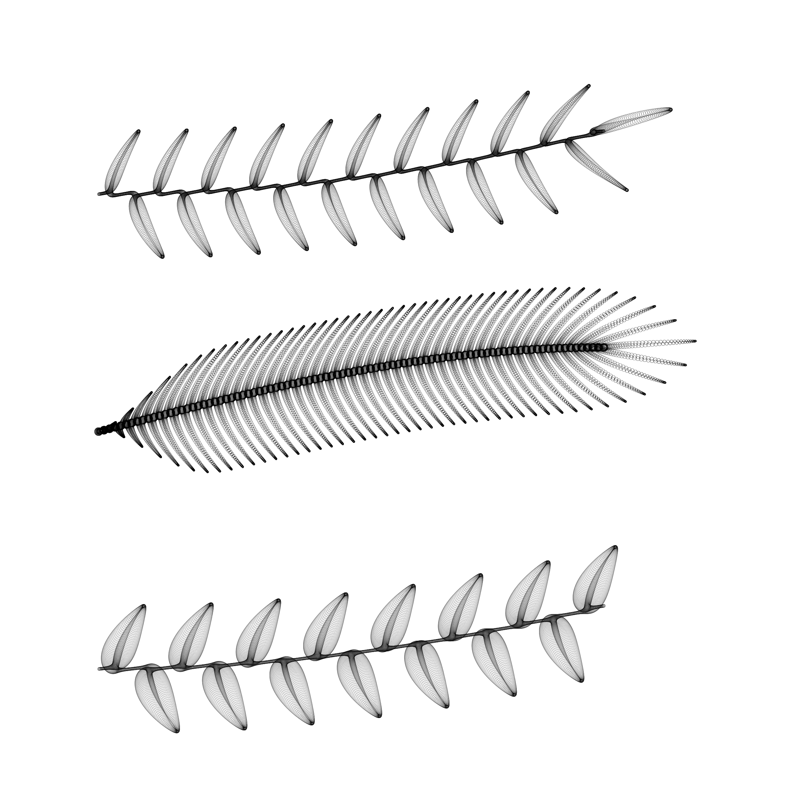
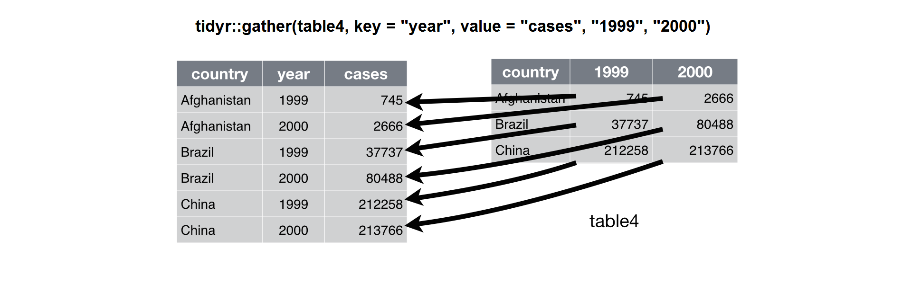
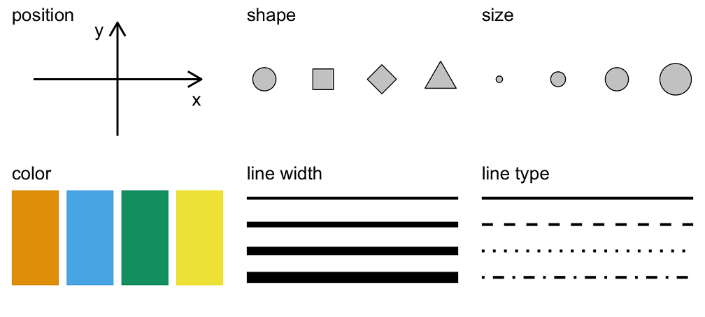
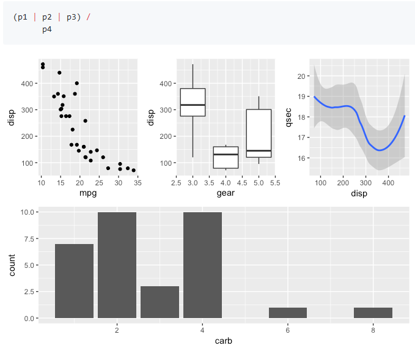
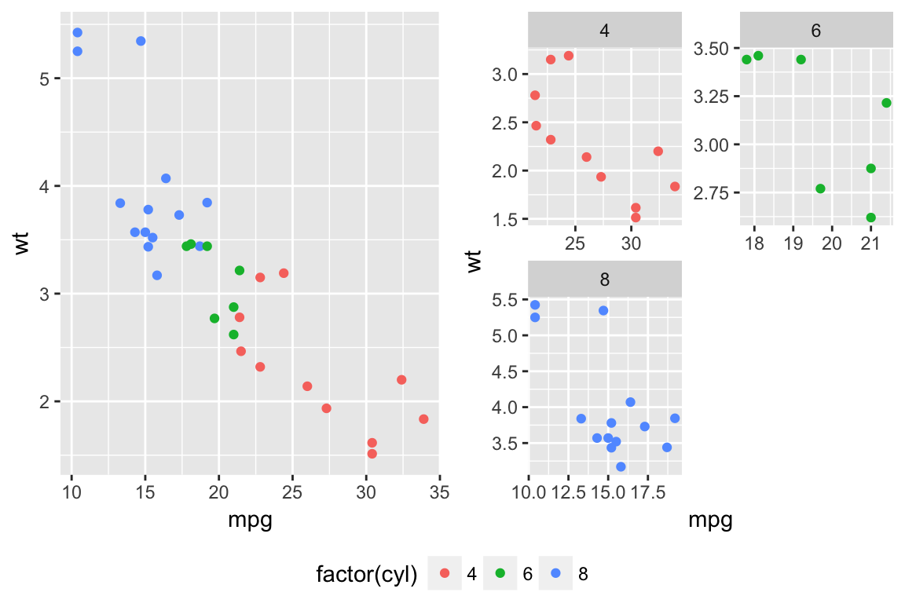
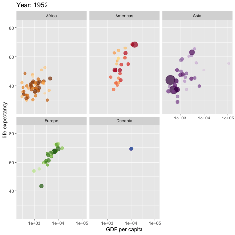
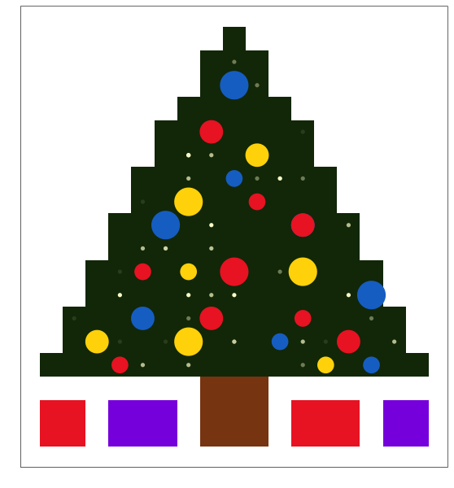

```{r knitr_setup, include=FALSE, cache=FALSE}

library(knitr)

### Chunk options ###

## Text results
opts_chunk$set(echo = FALSE, warning = FALSE, message = FALSE, eval = TRUE, size = 'footnotesize')

## Code decoration
opts_chunk$set(tidy = FALSE, comment = NA, highlight = TRUE, prompt = FALSE)

# ## Cache
opts_chunk$set(cache = TRUE, cache.path = "knitr_output/cache/")

# ## Plots
opts_chunk$set(fig.path = "knitr_output/figures/")
opts_chunk$set(fig.align = 'center')

### Hooks ###
## Crop plot margins
#knit_hooks$set(crop = hook_pdfcrop)

## Reduce font size
# see http://stackoverflow.com/a/39961605
knit_hooks$set(smallfont = function(before, options, envir) {
  if (before) return(paste0("\n \\", options$size, "\n\n"))
  else return("\n\n \\normalsize \n")
  })

```


## Always plot data!

```{r echo=FALSE}
library(ggplot2)
library(datasauRus)
ggplot(subset(datasaurus_dozen, dataset != "x_shape"), aes(x = x, y = y)) +
  facet_wrap(~dataset, ncol = 4) +
  geom_point(size = 1) +
  theme_bw() +
  theme(legend.position = "none", strip.text = element_blank()) 

```

https://github.com/stephlocke/datasauRus


## Made with ggplot

```{r}
include_graphics("images/ggraph1.png")
```

https://github.com/thomasp85/ggraph


## Made with ggplot

```{r}
include_graphics("images/bike_pollution_web.png")
```

http://spatial.ly/2012/02/great-maps-ggplot2/


## Made with ggplot

```{r out.height="3in", out.width="4in"}
include_graphics("images/heatmap_rudis.png")
```

https://rud.is/b/2016/02/14/making-faceted-heatmaps-with-ggplot2/


## Made with ggplot

```{r out.height="3in", out.width="4in"}
include_graphics("images/cloropleth_rudis.png")
```

https://rud.is/b/2016/03/29/easier-composite-u-s-choropleths-with-albersusa/


## Made with ggplot

```{r}
include_graphics("images/ggtree.png")
```

https://guangchuangyu.github.io/ggtree/


## Made with ggplot

```{r}

```

https://github.com/marcusvolz/mathart


# Why ggplot?


## Why ggplot

- Extremely powerful and flexible

- Consistent (grammar of graphics)

- Very powerful user base and active development


## At the beginnning it's hard, but then it pays off

\begincols
\begincol
```{r out.width="2in", out.height="2in"}
include_graphics("images/learningcurve1.png")
```
\endcol

\begincol
```{r out.width="2in", out.height="2in"}
include_graphics("images/learningcurve2.png")
```
\endcol
\endcols

Source: https://github.com/jennybc/ggplot2-tutorial


## Very good documentation and tutorials


- [Official ggplot2 documentation](https://ggplot2.tidyverse.org/reference/)  
- [ggplot2 book](https://github.com/hadley/ggplot2-book) 
- [R graphics cookbook](http://shop.oreilly.com/product/0636920023135.do) and [Cookbook for R](http://www.cookbook-r.com/Graphs/)  
- [Beautiful plotting in R: A ggplot2 cheatsheet](http://zevross.com/blog/2014/08/04/beautiful-plotting-in-r-a-ggplot2-cheatsheet-3/)  
- [Introduction to ggplot2](http://opr.princeton.edu/workshops/201401/ggplot2Jan2014DawnKoffman.pdf) 
- [Tutorial: ggplot2](http://www.ceb-institute.org/bbs/wp-content/uploads/2011/09/handout_ggplot2.pdf)  
- [How to format plots for publication using ggplot2](http://www.noamross.net/blog/2013/11/20/formatting-plots-for-pubs.html)  
- [Visualising data with ggplot2](http://handsondatascience.com/GGPlot2O.pdf) 
- [Data Visualization with R and ggplot2](https://github.com/pablobarbera/Rdataviz)  
- [ggplot2 tutorial](https://github.com/jennybc/ggplot2-tutorial)  
- [Data visualisation chapter in R for Data Science](http://r4ds.had.co.nz/data-visualisation.html)
- [The complete ggplot2 tutorial](http://r-statistics.co/Complete-Ggplot2-Tutorial-Part1-With-R-Code.html)
- [Data visualization: a practical introduction (K. Healy)](http://socviz.co/)
- [Fundamentals of data visualization (C. Wilke)](http://serialmentor.com/dataviz/)


## Cheatsheet

```{r}
include_graphics("images/cheatsheet.png")
```

https://www.rstudio.com/resources/cheatsheets/


## Repos of figures + code


- [R graph catalog](http://shiny.stat.ubc.ca/r-graph-catalog/)

- [From Data to Viz](https://www.data-to-viz.com/)

- [The R graph gallery](http://www.r-graph-gallery.com/)

- [R graph gallery](http://rgraphgallery.blogspot.com/)

- [Cookbook for R: Graphs](http://www.cookbook-r.com/Graphs/)

- [Graphical data analysis with R](http://www.gradaanwr.net/)

- [IEG figures](https://github.com/PJordano-Lab/R-figures)


## Find answers for all your questions in Stack Overflow

\begincols
\begincol
```{r}
include_graphics("images/so.png")
```
\endcol

\begincol
```{r}
include_graphics("images/so2.png")
```
\endcol
\endcols


# Building a ggplot figure

## Our example dataset: paper planes flying experiment

```{r echo=c(1,3)}
library(paperplanes)
data(paperplanes)
head(paperplanes)
```


---

Ensuring `paper` is factor, not numeric

```{r echo=TRUE}
paperplanes$paper <- as.factor(paperplanes$paper)
```


## Data must be a tidy data frame

```{r out.width="3.5in", out.height="3.5in"}
include_graphics("images/tidy-1.png")
```

```{r out.width="3.5in", out.height="3.5in"}

```

http://r4ds.had.co.nz/tidy-data.html


## Calling ggplot

```{r echo=TRUE, cache=FALSE}
library(ggplot2)
ggplot(paperplanes)
```


-----

```{r eval=FALSE, echo=TRUE}
ggplot(paperplanes)
```

First argument is a tidy data frame


## What variables as axes?

```{r echo=TRUE}
ggplot(paperplanes) +
  aes(x = age, y = distance)
```

Note syntax: + followed by new line


----

```{r echo=TRUE, eval=FALSE}
ggplot(paperplanes) +
  aes(x = age, y = distance)
```

**Aesthetics** (`aes`) map data variables (*age*, *distance*) to graphic elements (*axes*)

```{r out.width="4in", out.height="3in"}

```

http://serialmentor.com/dataviz/aesthetic-mapping.html


## Adding layers (geoms)

```{r echo=TRUE, eval=TRUE}
ggplot(paperplanes) +
  aes(x = age, y = distance) +
  geom_point()
```


## Changing point size and type

```{r echo=TRUE}
ggplot(paperplanes) +
  aes(x = age, y = distance) + 
  geom_point(size = 2)
```

Check out `geom_point` help [here](https://ggplot2.tidyverse.org/reference/geom_point.html)


## Changing point size and type

```{r echo=TRUE}
ggplot(paperplanes) +
  aes(x = age, y = distance) + 
  geom_point(size = 2, shape = 8)
```


## Changing point size and type

```{r echo=TRUE}
ggplot(paperplanes) +
  aes(x = age, y = distance) + 
  geom_point(size = 2, shape = 16, colour = "blue")
```


## Map geom aesthetics (e.g. colour) to variable

```{r echo=TRUE}
ggplot(paperplanes) +
  aes(x = age, y = distance) +  
  geom_point(aes(colour = paper))
```


----

Note difference between

```{r eval=FALSE, echo=TRUE}
geom_point(colour = "blue")  # colour is given a concrete value ('blue')
```

```{r eval=FALSE, echo=TRUE}
geom_point(aes(colour = gender))  # colour maps a *variable* (using `aes`)
```


----

\begincols
\begincol

This works:

```{r echo=TRUE}
ggplot(paperplanes) +
  aes(x = age, y = distance) +  
  geom_point(aes(colour = paper))
```

\endcol

\begincol

This doesn't work:

```{r echo=TRUE, eval=FALSE}
ggplot(paperplanes) +
  aes(x = age, y = distance) +  
  geom_point(colour = paper)
```

*Error in layer(data = data, mapping = mapping, stat = stat, geom = GeomPoint,  : *
  *object 'paper' not found*
  
'paper' is a variable in dataframe

Must use `aes`

\endcol
\endcols


----

Each geom can have their own aesthetics (`aes`)

Even use different data


## Map geom aesthetics (colour, shape) to variable

```{r echo=TRUE}
ggplot(paperplanes) +
  aes(x = age, y = distance) + 
  geom_point(aes(colour = paper, shape = paper))
```


## Map geom aesthetics (colour, shape) to variable

```{r echo=TRUE}
ggplot(paperplanes) +
  aes(x = age, y = distance) + 
  geom_point(aes(colour = paper, shape = gender))
```


## Change colour scale

```{r echo=TRUE}
ggplot(paperplanes) +
  aes(x = age, y = distance) + 
  geom_point(aes(colour = paper)) +
  scale_colour_manual(values = c("orange", "blue"))
```


```{r echo=FALSE, eval=FALSE}
ggplot(paperplanes) +
  aes(x = age, y = distance) + 
  geom_point(aes(colour = paper)) +
  scale_colour_brewer(type = "qual", palette = 6)
```


## Change axis labels: xlab & ylab


```{r echo=TRUE}
ggplot(paperplanes) +
  aes(x = age, y = distance) + 
  geom_point(aes(colour = paper)) +
  labs(x = "Age (years)", y = "Distance (m)")
```


## Set title

```{r echo=TRUE}
ggplot(paperplanes) +
  aes(x = age, y = distance) + 
  geom_point(aes(colour = paper)) +
  labs(x = "Age (years)", y = "Distance (m)") +
  labs(title = "Distance flown by age")
```


## Adding more layers

```{r echo=TRUE}
ggplot(paperplanes) +
  aes(x = age, y = distance) + 
  geom_point() +
  geom_smooth(method = "lm")
```


## Adding more layers

```{r echo=1}
ggplot(paperplanes) +
  aes(x = age, y = distance) + 
  geom_point() +
  geom_smooth(method = "lm") + 
  geom_vline(xintercept = c(20, 40, 60))
```


## Adding more layers

```{r echo=1}
ggplot(paperplanes) +
  aes(x = age, y = distance) + 
  geom_point() +
  geom_smooth(method = "lm") + 
  geom_vline(xintercept = c(20, 40, 60)) + 
  geom_hline(yintercept = 10)
```


## Summary

```{r eval=FALSE, echo=TRUE}
ggplot(paperplanes) +          # Name of (tidy) data frame
  aes(x = age, y = distance) + # Aesthetics (variables to map in axes)
  geom_point()                 # Geoms: geometric objects
```


## Exercise: Make a plot like this one

```{r}
ggplot(paperplanes) +
  aes(x = gender, y = distance) +
  geom_boxplot() +
  labs(x = "Gender", y = "Distance (m)", 
       title = "Distance flown by gender")
```


## Exercise: Make a plot like this one

```{r}
ggplot(paperplanes) +
  aes(x = gender, y = distance) +
  geom_violin() +
  labs(x = "Gender", y = "Distance (m)", 
       title = "Distance flown by gender")
```


## Exercise: Make a plot like this one

```{r}
ggplot(paperplanes) +
  aes(x = gender, y = distance) +
  geom_violin(fill = "orange") +
  geom_point() +
  labs(x = "Gender", y = "Distance (m)", 
       title = "Distance flown by gender")
```


## Exercise: Make a plot like this one

```{r}
ggplot(paperplanes) +
  aes(x = distance) +
  geom_density(aes(colour = gender, fill = gender), alpha = 0.5) +
  labs(x = "Distance (m)", 
       title = "Distances flown by gender")
```


## Exercise: Make a plot like this one

```{r echo=TRUE}
ggplot(paperplanes) +
  aes(x = age, y = distance, colour = paper) + 
  geom_point() +
  geom_smooth(method = "lm")
```


# ggplot2 figures can be assigned to R objects

## Assigning ggplot objects

```{r echo=TRUE}
myplot <- ggplot(paperplanes) +
  aes(x = age, y = distance) 
myplot + geom_point()
```


## Assigning ggplot objects

```{r echo=TRUE}
myplot <- ggplot(paperplanes) +
  aes(x = age, y = distance) 
myplot <- myplot + geom_point()
myplot
```


## Assigning ggplot objects

```{r echo=TRUE}
baseplot <- ggplot(paperplanes) + 
  aes(x = age, y = distance)
scatterplot <- baseplot + geom_point()
labelled <- scatterplot + labs(x = "Age (years)", y = "Distance (m)")
labelled
```


# Themes: changing plot appearance


## myplot

```{r echo=1}
myplot <- ggplot(paperplanes) + 
  aes(x = age, y = distance, colour = paper) + 
  geom_point() 
myplot
```


## theme_classic

```{r echo=TRUE}
myplot + theme_classic()
```


## theme_minimal

```{r echo=TRUE}
myplot + theme_minimal()
```


## Lots of themes out there

```{r echo=TRUE}
library(ggthemes)
myplot + theme_economist()
```


## Lots of themes out there

```{r echo=TRUE}
myplot + theme_wsj()
```


## Editing themes

```{r echo=TRUE, eval=FALSE}
?theme
```

- `element_blank`
- `element_text`
- `element_line`
- `element_rect` (borders & backgrounds)


## Exercise: make a plot like this one

```{r}
ggplot(paperplanes) +
  aes(x = age, y = distance, colour = paper) +
  geom_point() + 
  labs(x = "Age (years)", y = "Distance (m)", 
       title = "Changing plot appearance") +
  theme(axis.title.x = element_text(colour = "blue"),
        axis.title.y = element_text(colour = "red"),
        plot.title = element_text(size = 16),
        legend.key = element_rect(fill = "white"),
        legend.position = "bottom"
        )
```


## Easily changing appearance with ggthemeassist (Rstudio addin)

https://github.com/calligross/ggthemeassist

```{r}
myplot
```


## Easily changing appearance with ggedit

https://github.com/metrumresearchgroup/ggedit

```{r}
myplot
```


## Think twice before editing plots out of R

```{r out.height="3in", out.width="4in"}
include_graphics("images/trevor_tweet.png")
```

http://mbjoseph.github.io/2015/02/26/plotting.html

serialmentor.com/dataviz/choosing-the-right-visualization-software.html


## Think twice before editing plots out of R

Referee #3: 

"Please increase font size in all figures"

```{r echo=TRUE}
myplot +
  theme(axis.title = element_text(size = 18))
```


## Publication-quality plots

```{r echo=TRUE}
library(cowplot)
myplot
```


----

Some publication themes:

https://gist.github.com/Pakillo/c2c7ea11c528cc2ee20f#themes


# Composite figures

## Composite figures: cowplot

```{r echo=TRUE, out.width='4in', out.height='3in'}
library(cowplot)
plot1 <- ggplot(paperplanes) + aes(age, distance) + geom_point()
plot2 <- ggplot(paperplanes) + aes(gender, distance) + geom_boxplot()
plot_grid(plot1, plot2, labels = "AUTO")
```


## Composite figures

```{r echo=3, out.width='3in', out.height='5in'}
plot1 <- ggplot(paperplanes) + aes(age, distance) + geom_point()
plot2 <- ggplot(paperplanes) + aes(gender, distance) + geom_boxplot()
plot_grid(plot1, plot2, labels = "AUTO", ncol = 1)
```


## Composite figures: patchwork

```{r}

```

https://github.com/thomasp85/patchwork


## Composite figures: egg

```{r}

```

https://cran.r-project.org/web/packages/egg/index.html


## Saving plot

```{r echo=TRUE, eval=FALSE}
ggsave("myplot.pdf")
```

```{r echo=TRUE, eval=FALSE}
save_plot("myplot.pdf")
```


# Facetting

## Facetting

```{r echo=TRUE, out.width='3in', out.height='2.5in'}
ggplot(paperplanes) + aes(age, distance) +
    geom_point() + theme_bw(base_size = 12) +
  facet_wrap(~paper)
```


## Facetting

```{r echo=TRUE, out.width='3in', out.height='2.5in'}
ggplot(paperplanes) +
  geom_histogram(aes(distance)) + 
  theme_minimal(base_size = 8) + 
  facet_wrap(~paper, nrow = 2)
```


## Interactivity: plotly

```{r echo=TRUE, eval=FALSE}
library(plotly)
myplot <- ggplot(paperplanes, aes(age, distance)) + geom_point()
ggplotly(myplot)
```


## Animated graphs

https://github.com/thomasp85/gganimate

[](https://github.com/thomasp85/gganimate#yet-another-example)


# Summarising


## Grammar of graphics

- **Data** (tidy data frame)

- **Layers** (**geoms**: points, lines, polygons...)

- **Aesthetics** mappings (x, y, size, colour...)

- **Scales** (colour, size, shape...)

- **Facets** (small multiples)

- **Themes** (appearance)

- **Coordinate system** (Cartesian, polar, map projections...)


## Exercise: make a plot like this one

```{r}
ggplot(paperplanes) +
  aes(factor(paper), distance) +
  geom_violin()
```


## Exercise: make a plot like this one

```{r fig.height=4, fig.width=5}
ggplot(paperplanes) +
  aes(age, distance) +
  geom_point() +
  geom_smooth() +
  theme_minimal(base_size = 8) +
  facet_wrap(~gender, nrow = 2) +
  labs(x = "Age (years)", y = "Distance (m)", 
       title = "Distance flown by age and gender")
```


## Exercise: make a plot like this one

```{r fig.height=4, fig.width=5}
ggplot(paperplanes) +
  aes(age, distance) +
  geom_point(aes(colour = gender)) +
  geom_smooth(aes(colour = gender)) +
  theme_minimal(base_size = 12) +
  labs(x = "Age (years)", y = "Distance (m)", 
       title = "Distance flown by age and gender")
```


## Exercise: make a plot like this one

```{r out.height="3.5in"}
ggplot(paperplanes) +
  geom_histogram(aes(age)) +
  facet_wrap(~gender, nrow = 2) + 
  labs(x = "Age (years)", y = "Number of individuals", 
       title = "Age distribution per gender") +
  theme(plot.title = element_text(hjust = 0.5))
```


```{r include=FALSE, eval=FALSE}
library(rotl)
library(ggtree)
lauraceae <- tnrs_match_names(c("Quercus suber", "Quercus ilex", "Pinus pinea", "Laurus nobilis"))
lautree <- tol_induced_subtree(ott_ids = unlist(ott_id(lauraceae)))
ggtree(lautree) + geom_tiplab() 
```


## Exercise: make a plot like this one

Data from http://www.columbia.edu/~mhs119/Sensitivity+SL+CO2/Table.txt

```{r cache=TRUE, out.width='7in'}
hansen <- read.table("http://www.columbia.edu/~mhs119/Sensitivity+SL+CO2/Table.txt",
                     header = FALSE, dec = ".", nrows = 17604, skip = 9)
hansen <- hansen[, c(3,6)]
names(hansen) <- c("MyrBP", "Tabs")
hansen$logtime <- log10(hansen$MyrBP)


timebreaks <- c(0.001, 0.01, 0.1, 1, 10, 66)  # in MyrBP
timebreaks.log <- log10(timebreaks)
time.labels <- latex2exp::TeX(c("10^{-3}", "10^{-2}",
                  "10^{-1}", "1", "10", "66"))

temp <- ggplot(hansen, aes(x = logtime, y = Tabs)) +
  ylim(9, 30) +
  labs(x = "Millions of years BP", y = "Temperature (ºC)") +
  theme(axis.text.x = element_text(size = 10)) +
  geom_line(colour = "Dark Red") +
  scale_x_continuous(breaks = timebreaks.log,
                     labels = time.labels,
                     trans = "reverse")


epochs.start <- c(0.0117, 2.58, 5.333, 23.03, 33.9, 56, 66)  # from geoscale

temp.paleo <- temp +
  geom_vline(xintercept = log10(epochs.start), linetype = "dashed", size = 0.2) +
  annotate("text", label = c("P", "Eo", "Ol", "Mi", "Pli", "Ple", "Hol"),
            x = c(1.78, 1.63, 1.44, 1.07, 0.58, -0.7, -2.9),
           y = 30, size = 3)
temp.paleo
```


## Exercise: make a plot like this one

```{r out.width="2in", out.height="3in"}

```


## END


Slides and source code available at https://github.com/Pakillo/ggplot-intro


