```{r knitr_setup, include=FALSE, cache=FALSE}

library(knitr)

### Chunk options ###

## Text results
opts_chunk$set(echo = FALSE, warning = FALSE, message = FALSE, eval = TRUE, size = 'footnotesize')

## Code decoration
opts_chunk$set(tidy = FALSE, comment = NA, highlight = TRUE, prompt = FALSE, crop = TRUE)

# ## Cache
opts_chunk$set(cache = TRUE, cache.path = "knitr_output/cache/")

# ## Plots
opts_chunk$set(fig.path = "knitr_output/figures/")
opts_chunk$set(fig.align = 'center')

### Hooks ###
## Crop plot margins
knit_hooks$set(crop = hook_pdfcrop)

## Reduce font size
# see http://stackoverflow.com/a/39961605
knit_hooks$set(smallfont = function(before, options, envir) {
  if (before) return(paste0("\n \\", options$size, "\n\n"))
  else return("\n\n \\normalsize \n")
  })

```


## Made with ggplot

```{r}
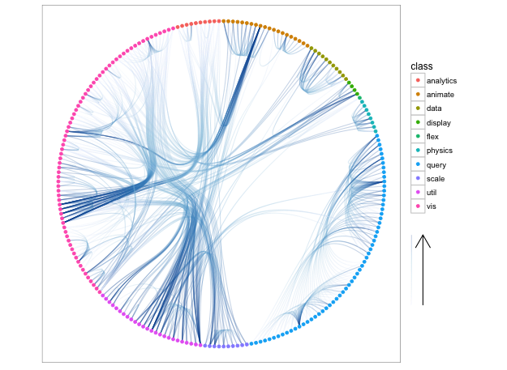
```

https://github.com/thomasp85/ggraph


## Made with ggplot

```{r}
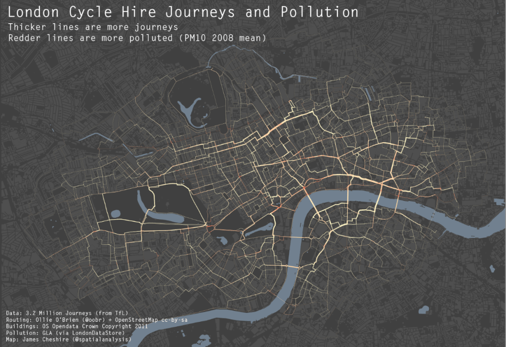
```

http://spatial.ly/2012/02/great-maps-ggplot2/


## Made with ggplot

```{r out.height="3in", out.width="4in"}
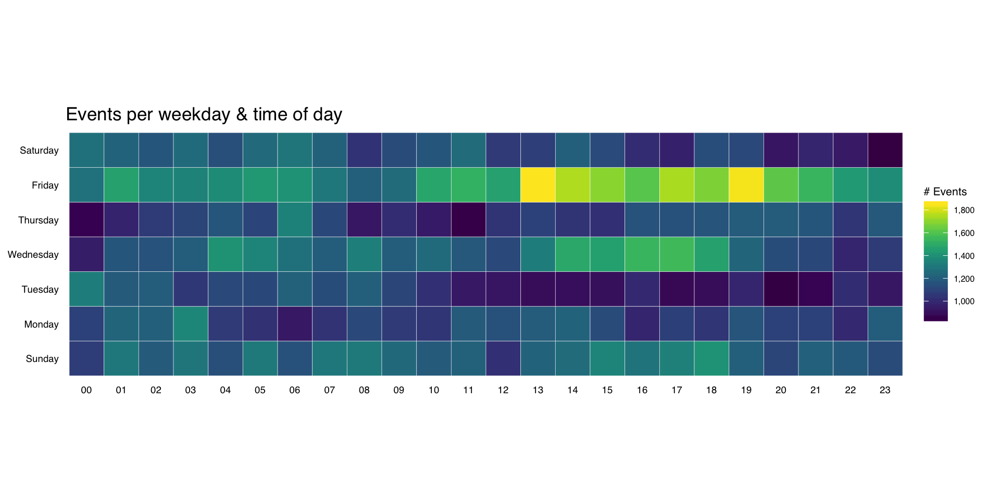
```

https://rud.is/b/2016/02/14/making-faceted-heatmaps-with-ggplot2/


## Made with ggplot

```{r out.height="3in", out.width="4in"}
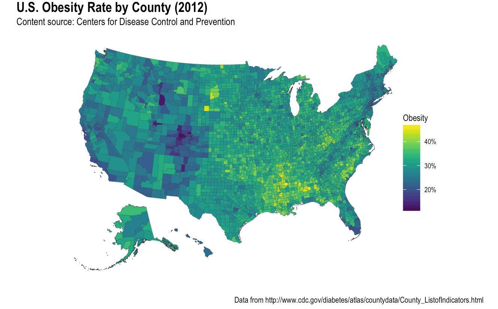
```

https://rud.is/b/2016/03/29/easier-composite-u-s-choropleths-with-albersusa/


## Made with ggplot

```{r}
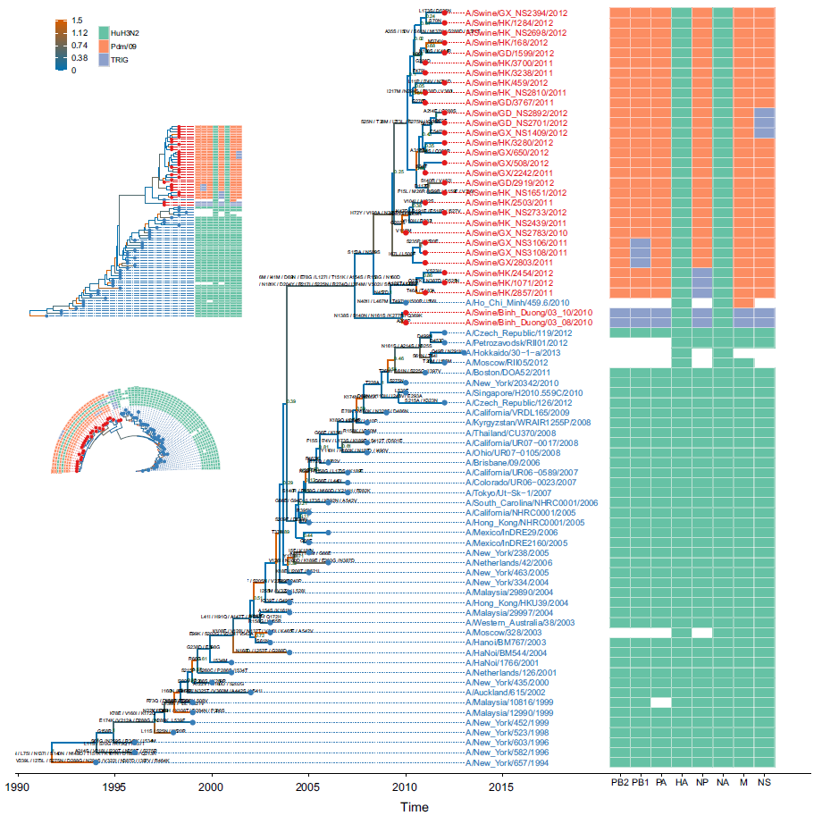
```

https://guangchuangyu.github.io/ggtree/


## Why ggplot

- Extremely powerful and flexible

- Consistent (grammar of graphics)

- Very powerful user base and active development


## At the beginnning it's hard, but then it pays off

\begincols
\begincol
```{r out.width="2in", out.height="2in"}
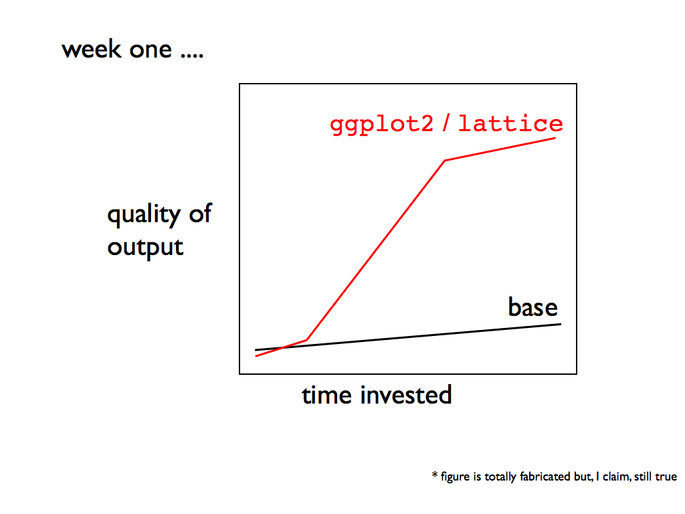
```
\endcol

\begincol
```{r out.width="2in", out.height="2in"}
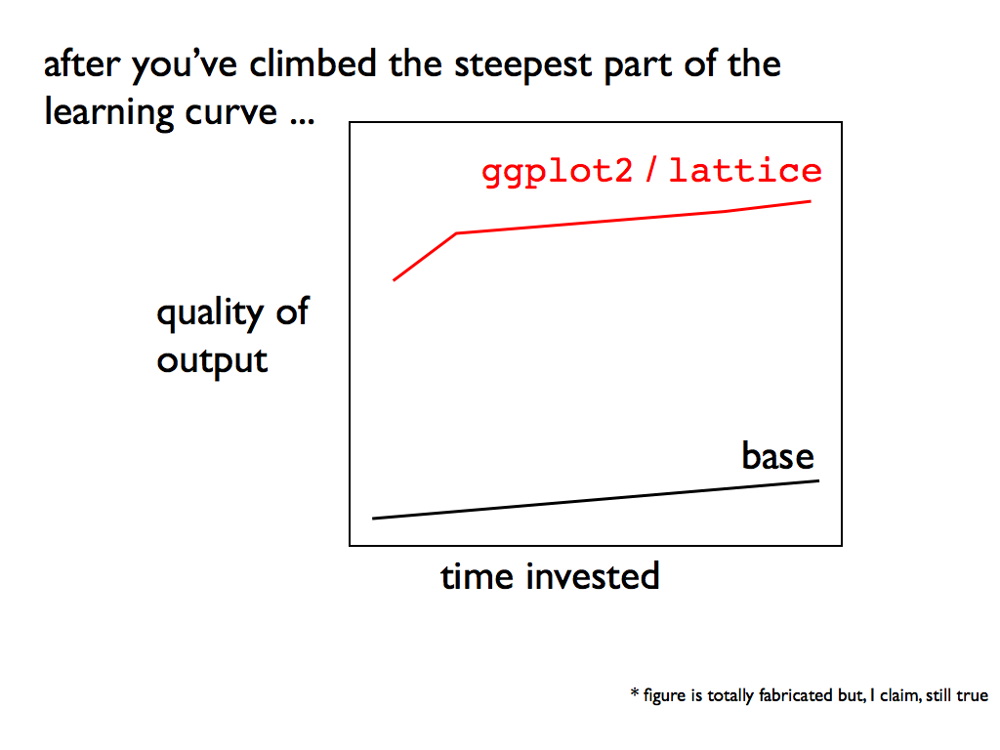
```
\endcol
\endcols

Source: https://github.com/jennybc/ggplot2-tutorial


## Very good documentation and tutorials


- [Official ggplot2 documentation](http://docs.ggplot2.org/current/)  
- [ggplot2 book](https://github.com/hadley/ggplot2-book) 
- [R graphics cookbook](http://shop.oreilly.com/product/0636920023135.do) and [Cookbook for R](http://www.cookbook-r.com/Graphs/)  
- [Beautiful plotting in R: A ggplot2 cheatsheet](http://zevross.com/blog/2014/08/04/beautiful-plotting-in-r-a-ggplot2-cheatsheet-3/)  
- [Introduction to ggplot2](http://opr.princeton.edu/workshops/201401/ggplot2Jan2014DawnKoffman.pdf) 
- [Tutorial: ggplot2](http://www.ceb-institute.org/bbs/wp-content/uploads/2011/09/handout_ggplot2.pdf)  
- [How to format plots for publication using ggplot2](http://www.noamross.net/blog/2013/11/20/formatting-plots-for-pubs.html)  
- [Visualising data with ggplot2](http://handsondatascience.com/GGPlot2O.pdf) 
- [Data Visualization with R and ggplot2](https://github.com/pablobarbera/Rdataviz)  
- [ggplot2 tutorial](https://github.com/jennybc/ggplot2-tutorial)  
- [Data visualisation chapter in R for Data Science](http://r4ds.had.co.nz/data-visualisation.html)


## Cheatsheet

```{r}
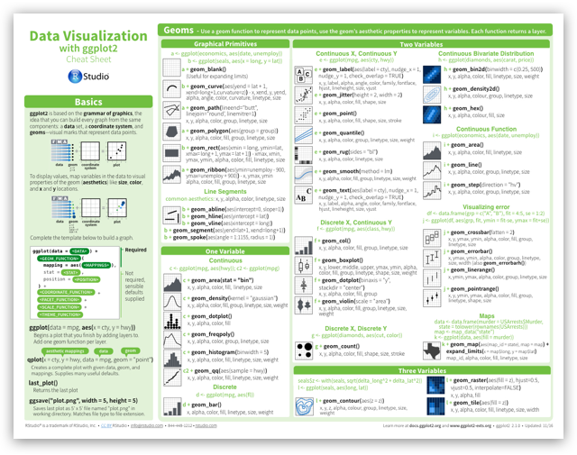
```

https://www.rstudio.com/wp-content/uploads/2016/11/ggplot2-cheatsheet-2.1.pdf


## Repos of figures + code

- [R graph catalog](http://shiny.stat.ubc.ca/r-graph-catalog/)

- [The R graph gallery](http://www.r-graph-gallery.com/)

- [R graph gallery](http://rgraphgallery.blogspot.com/)

- [Cookbook for R: Graphs](http://www.cookbook-r.com/Graphs/)

- [Graphical data analysis with R](http://www.gradaanwr.net/)

- [IEG figures](https://github.com/PJordano-Lab/R-figures)


## Find answers for all your questions in Stack Overflow

\begincols
\begincol
```{r}
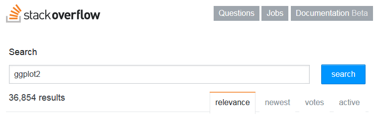
```
\endcol

\begincol
```{r}
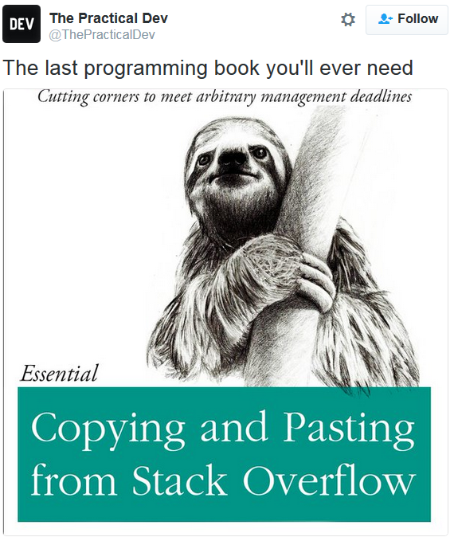
```
\endcol
\endcols


# Building a ggplot

## Our example dataset: tree heights and DBH

http://tinyurl.com/treesdata

- One species
- 10 plots
- 1000 trees
- Number of trees per plot ranging from 4 to 392

```{r echo=TRUE}
trees <- read.csv("data/trees.csv")
summary(trees[, 1:3])
```


## Data must be a tidy data frame

```{r out.width="3in", out.height="3in"}
include_graphics("images/tidy-1.png")
```

```{r out.width="3in", out.height="3in"}
include_graphics("images/tidy-9.png")
```

http://r4ds.had.co.nz/tidy-data.html


## Calling ggplot

```{r echo=TRUE, cache=FALSE}
library(ggplot2)
ggplot(trees)
```


## What variables as axes?

```{r echo=TRUE}
ggplot(trees, aes(x = dbh, y = height))
```

## Adding layers (geoms)

```{r echo=TRUE, eval=TRUE}
ggplot(trees, aes(x = dbh, y = height)) +
  geom_point()
```


## Adding layers (geoms)

```{r echo=TRUE, fig.height=3, fig.width=4}
myplot <- ggplot(trees, aes(x = dbh, y = height)) 
myplot + geom_point()
myplot
```

Check out `geom_point` help [here](http://docs.ggplot2.org/current/geom_point.html)


## Changing point size and type

```{r echo=TRUE}
myplot + geom_point(size = 2)
```


## Changing point size and type

```{r echo=TRUE}
myplot + geom_point(size = 2, shape = 18)
```


## Changing point size and type

```{r echo=TRUE}
myplot + geom_point(size = 2, shape = 18, colour = "blue")
```


## Map geom aesthetics to variable

```{r echo=TRUE}
myplot + geom_point(aes(colour = sex), size = 2)
```


## Map geom aesthetics to variable

```{r echo=TRUE}
myplot + geom_point(aes(colour = factor(plot)), size = 2)
```


## Map geom aesthetics to variable

```{r echo=TRUE}
myplot + geom_point(aes(colour = sex, shape = sex), size = 2)
```


## Change colour scale

```{r echo=TRUE}
myplot + geom_point(aes(colour = sex, shape = sex), size = 2) +
  scale_colour_brewer(type = "qual", palette = 7)
```


## Change colour scale

```{r echo=TRUE}
myplot + geom_point(aes(colour = sex, shape = sex), size = 2) +
  scale_colour_manual(values = c("pink", "blue"))
```


## Change axis labels: xlab & ylab

```{r echo=1:4}
myplot <- myplot + geom_point(aes(colour = sex, shape = sex), size = 2)
myplot <- myplot + 
  xlab("Diameter at Breast Height (cm)") +
  ylab("Height (m)")
myplot
```


## Set title: ggtitle

```{r echo=1}
myplot <- myplot + 
  ggtitle("Tree height and DBH")
myplot
```


## Adding another layer

```{r echo=1}
myplot <- myplot + geom_smooth(method = "lm")
myplot
```


## Adding another layer

```{r echo=TRUE}
myplot + geom_vline(xintercept = c(10, 20, 30, 40, 50))
```


## Exercise: Make a plot like this one

```{r}
ggplot(trees, aes(x = factor(plot), y = height)) +
  geom_boxplot() +
  xlab("Study plot") + 
  ylab("Height (m)") + 
  ggtitle("Tree heights per plot")
```


## Exercise: Make a plot like this one

```{r}
ggplot(trees, aes(x = factor(plot), y = height)) +
  geom_violin() +
  xlab("Study plot") + 
  ylab("Height (m)") + 
  ggtitle("Tree heights per plot") +
  geom_point()
```


# Themes: changing plot appearance


## myplot

```{r echo=1}
myplot <- ggplot(trees, aes(x = dbh, y = height)) + 
  geom_point()
myplot
```


## theme_classic

```{r echo=TRUE}
myplot + theme_classic()
```


## theme_minimal

```{r echo=TRUE}
myplot + theme_minimal()
```


## Lots of themes out there

```{r echo=TRUE}
library(ggthemes)
myplot + theme_economist()
```


## Lots of themes out there

```{r echo=TRUE}
myplot + theme_wsj()
```


## Editing themes

```{r echo=TRUE, eval=FALSE}
?theme
```


## Exercise: make a plot like this one

```{r}
ggplot(trees, aes(x = dbh, y = height, colour = sex)) +
  geom_point() + 
  xlab("DBH (cm)") + 
  ylab("Height (m)") + 
  ggtitle("Changing plot appearance") +
  theme(axis.title.x = element_text(colour = "blue"),
        axis.title.y = element_text(colour = "red"),
        plot.title = element_text(size = 18),
        legend.key = element_rect(fill = "white")
        )
```


## ggplot theme assistant (Rstudio addin)

https://github.com/calligross/ggthemeassist

```{r}
myplot
```


## Think twice before editing plots out of R

```{r out.height="3in", out.width="4in"}
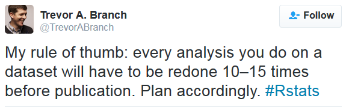
```

http://mbjoseph.github.io/2015/02/26/plotting.html


## Publication-quality plots

```{r echo=TRUE}
library(cowplot)
myplot
```


----

Publication themes:

https://gist.github.com/Pakillo/c2c7ea11c528cc2ee20f#themes


## Composite figures

```{r echo=TRUE}
library(cowplot)
plot1 <- ggplot(trees, aes(dbh, height)) + geom_point()
plot2 <- ggplot(trees, aes(factor(plot), height)) + geom_boxplot()
plot_grid(plot1, plot2, labels = "AUTO")
```


## Composite figures

```{r echo=3}
plot1 <- ggplot(trees, aes(dbh, height)) + geom_point()
plot2 <- ggplot(trees, aes(factor(plot), height)) + geom_boxplot()
plot_grid(plot1, plot2, labels = "AUTO", ncol = 1)
```


## Saving plot: ggsave

```{r echo=TRUE, eval=FALSE}
ggsave("myplot.pdf")
```


## Facetting

```{r echo=TRUE}
ggplot(trees, aes(dbh, height)) +
  geom_point() + theme_minimal(base_size = 8) +
  facet_wrap(~plot)
```


## Facetting

```{r echo=TRUE}
ggplot(trees) +
  geom_histogram(aes(height)) + theme_minimal(base_size = 8) + 
  facet_wrap(~plot, nrow = 2)
```


## Interactivity

```{r echo=TRUE}
suppressPackageStartupMessages(library(plotly))
myplot <- ggplot(trees, aes(dbh, height)) + geom_point()
ggplotly(myplot)
```


## Grammar of graphics

- Data (tidy data frame)

- Coordinate system (Cartesian, polar, map projections...)

- Layers (geoms: points, lines, polygons...)

- Aesthetics mappings (x, y, size, colour...)

- Scales (colour, size, shape...)

- Facets (small multiples)

- Themes (appearance)


## Exercise: make a plot like this one

```{r fig.height=4, fig.width=5}
ggplot(trees) +
  geom_histogram(aes(height, group = sex, colour = sex)) +
  theme_minimal(base_size = 8) +
  facet_wrap(~plot) +
  xlab("Height (m)") +
  ylab("Number of trees") +
  ggtitle("Distribution of heights by sex and plot")
```


## END


Slides and source code available at https://github.com/Pakillo/ggplot-intro


