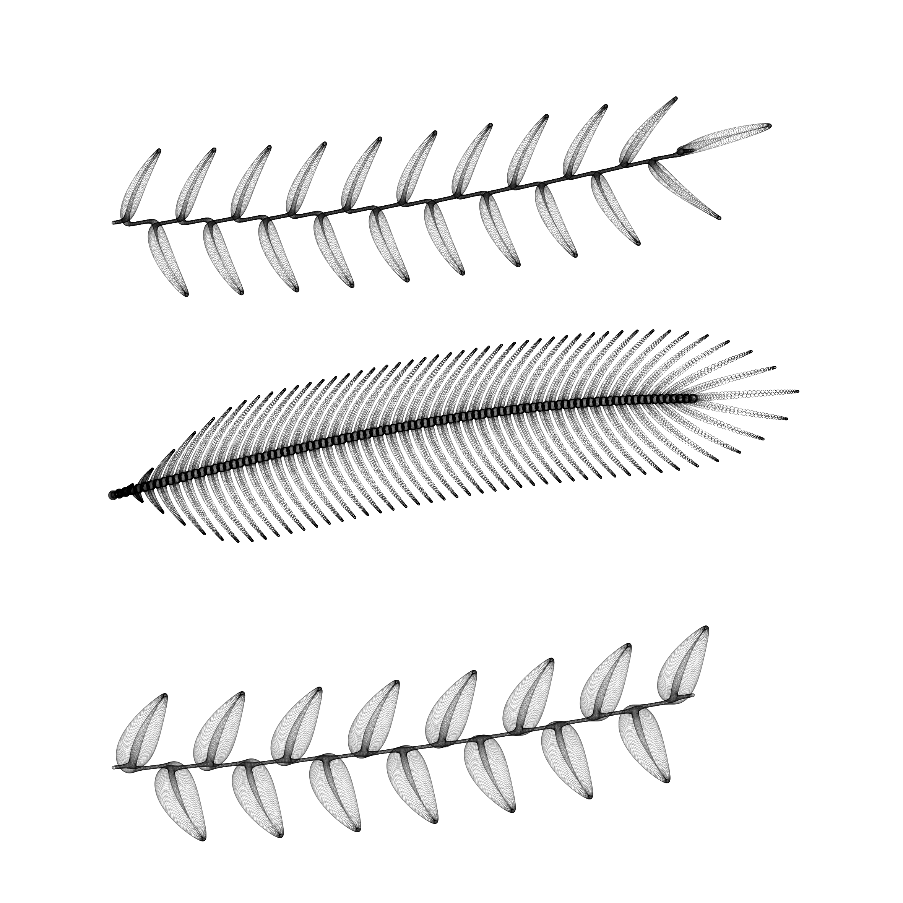
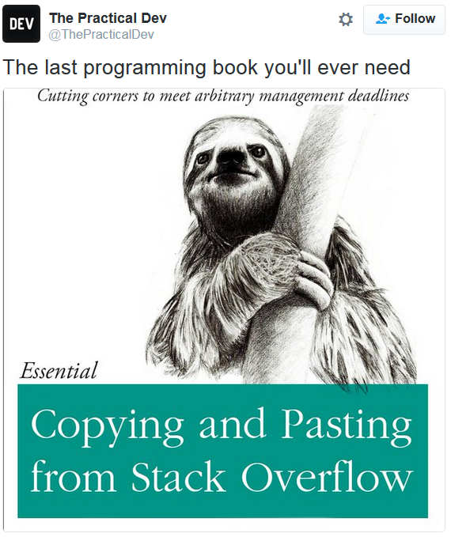
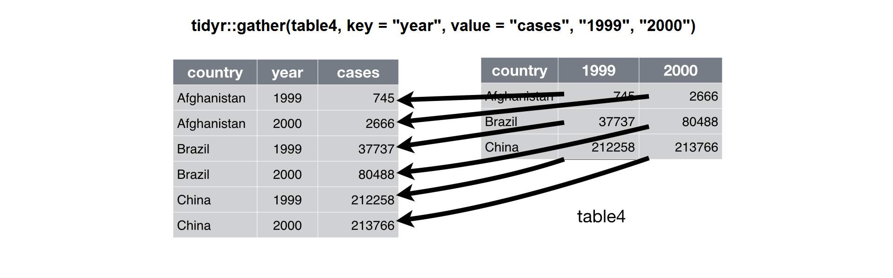
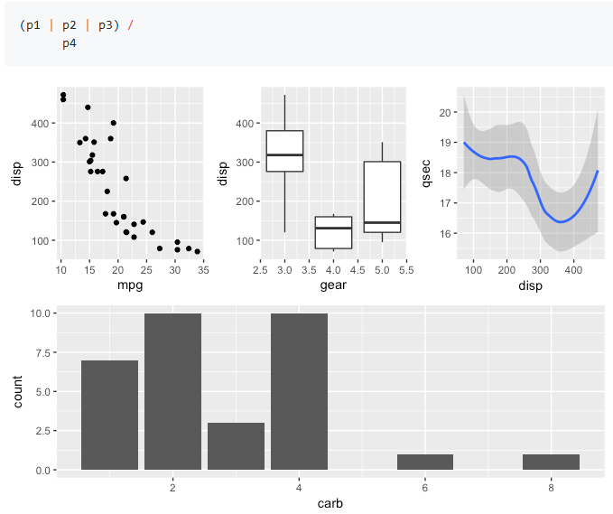
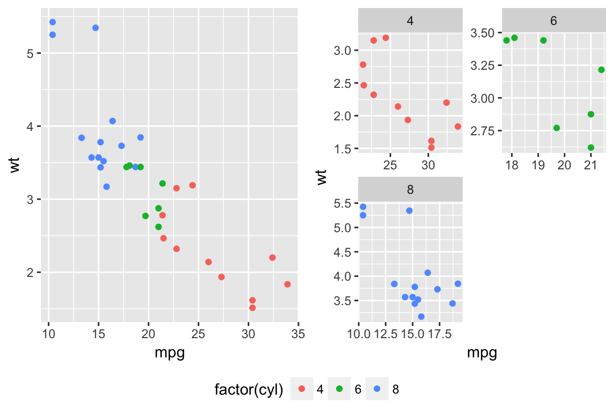
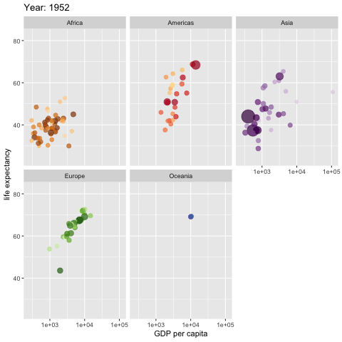

```{r setup, include=FALSE}
options(htmltools.dir.version = FALSE)
options(knitr.table.format = "html")

library(knitr)
knit_hooks$set(crop = hook_pdfcrop)
opts_chunk$set(echo = FALSE, message = FALSE, warning = FALSE, 
               crop = TRUE, cache = TRUE, comment = "")

opts_chunk$set(out.width = "70%", fig.align = "center", dpi = 150,
               fig.width = 4)
```


```{css, echo=FALSE}

.remark-slide-number {
  display: none;
}

.remark-slide-content {
  padding-top: 10px;
  padding-left: 80px;
  padding-right: 80px;
  padding-bottom: 20px;
}

.remark-slide-content p, ul, ol, li {
  font-size: 22px;
}


.remark-code, .remark-inline-code {
  background: #f0f0f0;
}

.remark-code {
  font-size: 18px;
}

.hugecode .remark-code { font-size: 200% }
.largecode .remark-code { font-size: 130% }
.smallcode .remark-code{ font-size: 70% }
.tinycode .remark-code { font-size: 50% }

.huge { font-size: 200% }
.large { font-size: 130% }
.small { font-size: 70% }
.tiny { font-size: 50% }

```


## Always plot data!

```{r echo=FALSE}
include_graphics("images/DinoSequential.gif")
```

https://github.com/stephlocke/datasauRus

---

## Made with ggplot

```{r out.width="60%"}
include_graphics("images/ggraph1.png")
```

https://github.com/thomasp85/ggraph

---

## Made with ggplot

```{r}
include_graphics("images/bike_pollution_web.png")
```

http://spatial.ly/2012/02/great-maps-ggplot2/

---

## Made with ggplot

```{r }
include_graphics("images/heatmap_rudis.png")
```

https://rud.is/b/2016/02/14/making-faceted-heatmaps-with-ggplot2/

---

## Made with ggplot

```{r }
include_graphics("images/cloropleth_rudis.png")
```

https://rud.is/b/2016/03/29/easier-composite-u-s-choropleths-with-albersusa/


---

## Made with ggplot

```{r out.width="40%"}

```

https://github.com/marcusvolz/mathart

---

## Why ggplot

- Extremely powerful and flexible

- Consistent (grammar of graphics)

- Very powerful user base and active development


---

## Very good documentation and tutorials

- [Official ggplot2 documentation](https://ggplot2.tidyverse.org/reference/)  

- [ggplot2 book](https://ggplot2-book.org/) 

- [Data visualisation chapter in R for Data Science](http://r4ds.had.co.nz/data-visualisation.html)

- [R graphics cookbook](https://r-graphics.org/) and [Cookbook for R](http://www.cookbook-r.com/Graphs/)  

- [Data visualization: a practical introduction (K. Healy)](http://socviz.co/)

- [Fundamentals of data visualization (C. Wilke)](http://serialmentor.com/dataviz/)


---

## Cheatsheet

```{r out.width="50%"}
include_graphics("images/cheatsheet.png")
```

https://www.rstudio.com/resources/cheatsheets/

---

## Repos of figures + code

- [From Data to Viz](https://www.data-to-viz.com/)

- [The R graph gallery](http://www.r-graph-gallery.com/)

- [R graphics cookbook](https://r-graphics.org/)

- [Cookbook for R: Graphs](http://www.cookbook-r.com/Graphs/)

- [Graphical data analysis with R](http://www.gradaanwr.net/)

- [R graph catalog](https://shiny.srvanderplas.com/r-graph-catalog/)


---

## Find answers in Stack Overflow, Rstudio Community, R4DS...

```{r out.width="40%"}

```


---
class: middle, center

# Building a ggplot figure

---

## Our example dataset: paper planes flying experiment

```{r echo=TRUE}
library(paperplanes)
data(paperplanes)
head(paperplanes)
```


---

## Ensuring 'paper' is factor, not numeric

Using dplyr:

```{r echo=c(-1)}
library(dplyr)
paperplanes <- paperplanes %>% 
  mutate(paper = as.factor(paper))
```


R base:

```{r echo=TRUE}
paperplanes$paper <- as.factor(paperplanes$paper)
```

---

## Data must be a tidy data frame

```{r }
include_graphics("images/tidy-1.png")
```

```{r }

```

http://r4ds.had.co.nz/tidy-data.html


---

## Calling ggplot

.pull-left[
```{r echo=TRUE, fig.show = 'hide'}
library(ggplot2)
ggplot(paperplanes)
```
]

.pull-right[
```{r echo = FALSE, out.width="100%", fig.asp = 0.9}
ggplot(paperplanes)
```
]


---

## First argument is a tidy data frame

.largecode[
```{r eval=FALSE, echo=TRUE}
ggplot(paperplanes)
```
]


---

## What variables as axes?

Note syntax: + followed by new line

.pull-left[
```{r echo=TRUE, fig.show='hide'}
ggplot(paperplanes) +
  aes(x = age, y = distance) #<<
```
]

.pull-right[
```{r echo=FALSE, out.width="100%", fig.asp = 0.9}
ggplot(paperplanes) +
  aes(x = age, y = distance) 
```
]

---

## Aesthetics (*aes*) map data variables (*age*, *distance*) to graphic elements (*axes*)

```{r echo=TRUE, eval=FALSE}
ggplot(paperplanes) +
  aes(x = age, y = distance) #<<
```

```{r }
include_graphics("images/aesthetics_Wilke.png")
```

http://serialmentor.com/dataviz/aesthetic-mapping.html


---

## Add layers (geoms)

.pull-left[
```{r echo=TRUE, fig.show='hide'}
ggplot(paperplanes) +
  aes(x = age, y = distance) +
  geom_point() #<<
```
]

.pull-right[
```{r echo=FALSE, fig.asp = 0.9, out.width="100%"}
ggplot(paperplanes) +
  aes(x = age, y = distance) +
  geom_point() #<<
```
]

---

## Change point size and type

.pull-left[
```{r echo=TRUE, fig.show='hide'}
ggplot(paperplanes) +
  aes(x = age, y = distance) +
  geom_point(size = 2) #<<
```
]

.pull-right[
```{r echo=FALSE, fig.asp = 0.9, out.width="100%"}
ggplot(paperplanes) +
  aes(x = age, y = distance) +
  geom_point(size = 2) #<<
```
]

Check out `geom_point` help [here](https://ggplot2.tidyverse.org/reference/geom_point.html)

---

## Change point size and type

.pull-left[
```{r echo=TRUE, fig.show='hide'}
ggplot(paperplanes) +
  aes(x = age, y = distance) +
  geom_point(size = 2, shape = 8) #<<
```
]

.pull-right[
```{r echo=FALSE, fig.asp = 0.9, out.width="100%"}
ggplot(paperplanes) +
  aes(x = age, y = distance) +
  geom_point(size = 2, shape = 8) #<<
```
]


---

## Change point size and type

.pull-left[
```{r echo=TRUE, fig.show='hide'}
ggplot(paperplanes) +
  aes(x = age, y = distance) +
  geom_point(size = 2, shape = 16, 
             colour = "blue") #<<
```
]

.pull-right[
```{r echo=FALSE, fig.asp = 0.9, out.width="100%"}
ggplot(paperplanes) +
  aes(x = age, y = distance) +
  geom_point(size = 2, shape = 16, 
             colour = "blue") #<<
```
]

---

## Map geom aesthetics (e.g. colour) to variable

.pull-left[
```{r echo=TRUE, fig.show='hide'}
ggplot(paperplanes) +
  aes(x = age, y = distance) +
  geom_point(aes(colour = paper)) #<<
```
]

.pull-right[
```{r echo=FALSE, fig.asp = 0.9, out.width="100%"}
ggplot(paperplanes) +
  aes(x = age, y = distance) +
  geom_point(aes(colour = paper)) #<<
```
]


---
class: middle, center

### Remember:

## 'aes' relates some graphical characteristic

## (colour, size, shape...) 

## to a variable in the data 


---
class: middle, left

Note difference between

```{r eval=FALSE, echo=TRUE}
geom_point(colour = "blue")  
# colour is given a concrete value ('blue')
```

```{r eval=FALSE, echo=TRUE}
geom_point(aes(colour = gender))  
# colour maps a *variable* in the data (gender) USING `aes`
```


---

.pull-left[
**This works:**

```{r echo=TRUE, out.width="100%", fig.asp = 0.9}
ggplot(paperplanes) +
  aes(x = age, y = distance) +  
  geom_point(aes(colour = paper)) #<<
```
]

.pull-right[
**This doesn't work:**

```{r echo=TRUE, eval=FALSE}
ggplot(paperplanes) +
  aes(x = age, y = distance) +  
  geom_point(colour = paper) #<<
```

*Error in layer(data = data, mapping = mapping, stat = stat, geom = GeomPoint,  : *
  *object 'paper' not found*
  
<br>

'paper' is a variable in dataframe, hence 

<br>

**must use `aes`**
]


---

## Map geom aesthetics (colour, shape) to variable

.pull-left[
```{r echo=TRUE, fig.show='hide'}
ggplot(paperplanes) +
  aes(x = age, y = distance) +
  geom_point(aes(colour = paper, 
                 shape = paper)) #<<
```
]

.pull-right[
```{r echo=FALSE, fig.asp = 0.9, out.width="100%"}
ggplot(paperplanes) +
  aes(x = age, y = distance) +
  geom_point(aes(colour = paper, 
                 shape = paper)) #<<
```
]

---

## Map geom aesthetics (colour, shape) to variable

.pull-left[
```{r echo=TRUE, fig.show='hide'}
ggplot(paperplanes) +
  aes(x = age, y = distance) +
  geom_point(aes(colour = paper, 
                 shape = gender)) #<<
```
]

.pull-right[
```{r echo=FALSE, fig.asp = 0.9, out.width="100%"}
ggplot(paperplanes) +
  aes(x = age, y = distance) +
  geom_point(aes(colour = paper, 
                 shape = gender)) #<<
```
]


---

## Change colour scale

.pull-left[
```{r echo=TRUE, fig.show='hide'}
ggplot(paperplanes) +
  aes(x = age, y = distance) +
  geom_point(aes(colour = paper)) +
  scale_colour_manual(values = c("orange", "blue")) #<<
```
]

.pull-right[
```{r echo=FALSE, fig.asp = 0.9, out.width="100%"}
ggplot(paperplanes) +
  aes(x = age, y = distance) +
  geom_point(aes(colour = paper)) +
  scale_colour_manual(values = c("orange", "blue")) #<<
```
]


```{r echo=FALSE, eval=FALSE}
ggplot(paperplanes) +
  aes(x = age, y = distance) + 
  geom_point(aes(colour = paper)) +
  scale_colour_brewer(type = "qual", palette = 6)
```


---

## Change axis labels: xlab & ylab

.pull-left[
```{r echo=TRUE, fig.show='hide'}
ggplot(paperplanes) +
  aes(x = age, y = distance) +
  geom_point(aes(colour = paper)) +
  labs(x = "Age (years)", #<<
       y = "Distance (m)") #<<
```
]

.pull-right[
```{r echo=FALSE, fig.asp = 0.9, out.width="100%"}
ggplot(paperplanes) +
  aes(x = age, y = distance) +
  geom_point(aes(colour = paper)) +
  labs(x = "Age (years)", #<<
       y = "Distance (m)") #<<
```
]


---

## Set title

.pull-left[
```{r echo=TRUE, fig.show='hide'}
ggplot(paperplanes) +
  aes(x = age, y = distance) +
  geom_point(aes(colour = paper)) +
  labs(x = "Age (years)", 
       y = "Distance (m)") +
  labs(title = "Distance flown by age") #<<
```
]

.pull-right[
```{r echo=FALSE, fig.asp = 0.9, out.width="100%"}
ggplot(paperplanes) +
  aes(x = age, y = distance) +
  geom_point(aes(colour = paper)) +
  labs(x = "Age (years)", 
       y = "Distance (m)") +
  labs(title = "Distance flown by age") #<<
```
]


---

## Adding more layers

.pull-left[
```{r echo=TRUE, fig.show='hide'}
ggplot(paperplanes) +
  aes(x = age, y = distance) +
  geom_point(aes(colour = paper)) +
  labs(x = "Age (years)", 
       y = "Distance (m)") +
  labs(title = "Distance flown by age") +
  geom_smooth(method = "lm") #<<
```
]

.pull-right[
```{r echo=FALSE, fig.asp = 0.9, out.width="100%"}
ggplot(paperplanes) +
  aes(x = age, y = distance) +
  geom_point(aes(colour = paper)) +
  labs(x = "Age (years)", 
       y = "Distance (m)") +
  labs(title = "Distance flown by age") +
  geom_smooth(method = "lm") #<<
```
]


---

## Adding more layers

.pull-left[
```{r echo=TRUE, fig.show='hide'}
ggplot(paperplanes) +
  aes(x = age, y = distance) +
  geom_point(aes(colour = paper)) +
  labs(x = "Age (years)", 
       y = "Distance (m)") +
  labs(title = "Distance flown by age") +
  geom_smooth(method = "lm") + 
  geom_vline(xintercept = c(20, 40, 60)) #<<
```
]

.pull-right[
```{r echo=FALSE, fig.asp = 0.9, out.width="100%"}
ggplot(paperplanes) +
  aes(x = age, y = distance) +
  geom_point(aes(colour = paper)) +
  labs(x = "Age (years)", 
       y = "Distance (m)") +
  labs(title = "Distance flown by age") +
  geom_smooth(method = "lm") + 
  geom_vline(xintercept = c(20, 40, 60)) #<<
```
]


---

## Adding more layers

.pull-left[
```{r echo=TRUE, fig.show='hide'}
ggplot(paperplanes) +
  aes(x = age, y = distance) +
  geom_point(aes(colour = paper)) +
  labs(x = "Age (years)", 
       y = "Distance (m)") +
  labs(title = "Distance flown by age") +
  geom_smooth(method = "lm") + 
  geom_vline(xintercept = c(20, 40, 60)) + 
  geom_hline(yintercept = 10) #<<
```
]

.pull-right[
```{r echo=FALSE, fig.asp = 0.9, out.width="100%"}
ggplot(paperplanes) +
  aes(x = age, y = distance) +
  geom_point(aes(colour = paper)) +
  labs(x = "Age (years)", 
       y = "Distance (m)") +
  labs(title = "Distance flown by age") +
  geom_smooth(method = "lm") + 
  geom_vline(xintercept = c(20, 40, 60)) + 
  geom_hline(yintercept = 10) #<<
```
]


---

## Summary

```{r eval=FALSE, echo=TRUE}
ggplot(paperplanes) +          # Name of (tidy) data frame
  aes(x = age, y = distance) + # Aesthetics (variables to map in axes)
  geom_point()                 # Geoms: geometric objects
```


---

## Exercise: Make a plot like this one

```{r out.width="50%", fig.asp = 0.9}
ggplot(paperplanes) +
  aes(x = gender, y = distance) +
  geom_boxplot() +
  labs(x = "Gender", y = "Distance (m)", 
       title = "Distance flown by gender")
```


---

## Exercise: Make a plot like this one

```{r out.width="50%", fig.asp = 0.9}
ggplot(paperplanes) +
  aes(x = gender, y = distance) +
  geom_violin() +
  labs(x = "Gender", y = "Distance (m)", 
       title = "Distance flown by gender")
```


---

## Exercise: Make a plot like this one

```{r out.width="50%", fig.asp = 0.9}
ggplot(paperplanes) +
  aes(x = gender, y = distance) +
  geom_violin(fill = "orange") +
  geom_point() +
  labs(x = "Gender", y = "Distance (m)", 
       title = "Distance flown by gender")
```

---

## Exercise: Make a plot like this one

```{r out.width="50%", fig.asp = 0.9}
ggplot(paperplanes) +
  aes(x = distance) +
  geom_density(aes(colour = gender, fill = gender), alpha = 0.5) +
  labs(x = "Distance (m)", 
       title = "Distances flown by gender")
```


---

## Exercise: Make a plot like this one

```{r out.width="50%", fig.asp = 0.9}
ggplot(paperplanes) +
  aes(x = age, y = distance, colour = paper) + 
  geom_point() +
  geom_smooth(method = "lm")
```


---
class: middle, center

# ggplot2 figures can be assigned to R objects

---

## Assigning ggplot objects

```{r echo=TRUE, out.width="30%", fig.asp = 0.9}
myplot <- ggplot(paperplanes) +
  aes(x = age, y = distance) 
myplot + geom_point()
```


---

## Assigning ggplot objects

```{r echo=TRUE, out.width="30%", fig.asp = 0.9}
myplot <- ggplot(paperplanes) +
  aes(x = age, y = distance) 
myplot <- myplot + geom_point()
myplot
```


---

## Assigning ggplot objects

```{r echo=TRUE, out.width="30%", fig.asp = 0.9}
baseplot <- ggplot(paperplanes) + 
  aes(x = age, y = distance)
scatterplot <- baseplot + geom_point()
labelled <- scatterplot + labs(x = "Age (years)", y = "Distance (m)")
labelled
```


---
class: inverse, middle, center

# Themes: changing plot appearance


---

## Create 'myplot'

.pull-left[
```{r echo=TRUE, fig.show='hide'}
myplot <- ggplot(paperplanes) + 
  aes(x = age, 
      y = distance, 
      colour = paper) + 
  geom_point() 

myplot
```
]

.pull-right[
```{r echo=FALSE, fig.asp = 0.9, out.width="100%"}
myplot <- ggplot(paperplanes) + 
  aes(x = age, 
      y = distance, 
      colour = paper) + 
  geom_point() 
myplot
```
]


---

## Use theme_classic

```{r echo=TRUE, fig.asp = 0.9, out.width="50%"}
myplot + theme_classic()
```

---

## theme_minimal

```{r echo=TRUE, fig.asp = 0.9, out.width="50%"}
myplot + theme_minimal()
```

---

## Lots of themes out there

```{r echo=TRUE, fig.asp = 0.9, out.width="50%"}
library(ggthemes)
myplot + theme_economist()
```


---

## Lots of themes out there

```{r echo=TRUE, fig.asp = 0.9, out.width="50%"}
myplot + theme_wsj()
```


---

## Editing themes

```{r echo=TRUE, eval=FALSE}
?theme
```

- `element_blank`

- `element_text`

- `element_line`

- `element_rect` (borders & backgrounds)


---

## Exercise: make a plot like this one

```{r out.width="50%", fig.asp = 0.9}
ggplot(paperplanes) +
  aes(x = age, y = distance, colour = paper) +
  geom_point() + 
  labs(x = "Age (years)", y = "Distance (m)", 
       title = "Changing plot appearance") +
  theme(axis.title.x = element_text(colour = "blue"),
        axis.title.y = element_text(colour = "red"),
        plot.title = element_text(size = 16),
        legend.key = element_rect(fill = "white"),
        legend.position = "bottom"
        )
```


---

## Easily changing appearance with ggthemeassist (Rstudio addin)

https://github.com/calligross/ggthemeassist

```{r out.width="80%"}
include_graphics("images/ggThemeAssist2.gif")
```

---

## Easily changing appearance with ggedit

https://github.com/yonicd/ggedit


---

## esquisse: ggplot2 builder addin

https://github.com/dreamRs/esquisse

```{r out.width="60%"}
include_graphics("https://raw.githubusercontent.com/dreamRs/esquisse/master/man/figures/esquisse.gif")
```


---

## Think twice before editing plots out of R

<br>

```{r out.width="60%"}
include_graphics("images/trevor_tweet.png")
```

<br>

[Why I think twice before editing plots out of R](https://mbjoseph.github.io/posts/2018-12-27-why-i-think-twice-before-editing-plots-in-powerpoint-illustrator-inkscape-etc/)

[Choosing the right visualization software](serialmentor.com/dataviz/choosing-the-right-visualization-software.html)

---

## Think twice before editing plots out of R

Referee #3: "Please increase font size in all figures"

```{r echo=TRUE, fig.asp = 0.9, out.width="50%"}
myplot +
  theme(axis.title = element_text(size = 18))
```


---

## Publication-quality plots

```{r echo=TRUE, fig.asp = 0.9, out.width="50%"}
library(cowplot)
myplot + theme_cowplot()
```


---

Some publication themes:

https://gist.github.com/Pakillo/c2c7ea11c528cc2ee20f#themes


---
class: inverse, middle, center

# Composite figures


---

## Composite figures: cowplot

```{r echo=TRUE, out.width="50%", fig.asp=0.65}
library(cowplot)
plot1 <- ggplot(paperplanes) + aes(age, distance) + geom_point()
plot2 <- ggplot(paperplanes) + aes(gender, distance) + geom_boxplot()
plot_grid(plot1, plot2, labels = "AUTO") #<<
```


---

## Composite figures

```{r echo=3, out.width="20%"}
plot1 <- ggplot(paperplanes) + aes(age, distance) + geom_point()
plot2 <- ggplot(paperplanes) + aes(gender, distance) + geom_boxplot()
plot_grid(plot1, plot2, labels = "AUTO", ncol = 1)
```


---

## Composite figures: patchwork

```{r out.width="50%"}

```

https://github.com/thomasp85/patchwork


---

## Composite figures: egg

```{r}

```

https://cran.r-project.org/web/packages/egg/index.html


---
class: middle, center

## Saving plot

```{r echo=TRUE, eval=FALSE}
ggsave("myplot.pdf")
```

```{r echo=TRUE, eval=FALSE}
save_plot("myplot.pdf")
```


---
class: inverse, middle, center

# Facetting (small multiples)


---

## Facetting

.pull-left[
```{r echo=TRUE, fig.show='hide'}
ggplot(paperplanes) + 
  aes(x = age, 
      y = distance) +
    geom_point() + 
  theme_bw(base_size = 12) +
  facet_wrap(~paper) #<<
```
]

.pull-right[
```{r echo=FALSE, fig.asp = 0.9, out.width="100%"}
ggplot(paperplanes) + 
  aes(x = age, 
      y = distance) +
    geom_point() + 
  theme_bw(base_size = 12) +
  facet_wrap(~paper) #<<
```
]

---

## Facetting

.pull-left[
```{r echo=TRUE, fig.show='hide'}
ggplot(paperplanes) +
  geom_histogram(aes(distance)) + 
  theme_minimal(base_size = 8) + 
  facet_wrap(~paper, nrow = 2) #<<
```
]

.pull-right[
```{r echo=FALSE, fig.asp = 0.9, out.width="100%"}
ggplot(paperplanes) +
  geom_histogram(aes(distance)) + 
  theme_minimal(base_size = 8) + 
  facet_wrap(~paper, nrow = 2) #<<
```
]


---

## Interactivity: plotly

.pull-left[
```{r echo=TRUE, eval = FALSE}
library(plotly)

myplot <- ggplot(paperplanes) +
  aes(age, distance) + 
  geom_point()

ggplotly(myplot)
```
]

.pull-right[
```{r echo=FALSE, out.width="100%", fig.asp = 0.9}
library(plotly)

myplot <- ggplot(paperplanes) +
  aes(age, distance) + 
  geom_point()

ggplotly(myplot)
```
]

---

## Animated graphs

https://github.com/thomasp85/gganimate

[](https://raw.githubusercontent.com/thomasp85/gganimate/master/man/figures/README-unnamed-chunk-4-1.gif)


---

## Automatic label placement

```{r}

```

https://cran.r-project.org/package=ggrepel


---

## Many extensions!

https://www.ggplot2-exts.org/

```{r}

```


---
class: inverse, middle, center

# Summary


---

## Grammar of graphics

- **Data** (tidy data frame)

- **Layers** (*geoms*: points, lines, polygons...)

- **Aesthetics** mappings (x, y, size, colour...)

- **Scales** (colour, size, shape...)

- **Facets** (small multiples)

- **Themes** (appearance)

- **Coordinate system** (Cartesian, polar, map projections...)


---

## Exercise: make a plot like this one

```{r fig.asp = 0.9, out.width="50%"}
ggplot(paperplanes) +
  aes(factor(paper), distance) +
  geom_violin()
```


---

## Exercise: make a plot like this one

```{r fig.asp = 0.9, out.width="50%"}
ggplot(paperplanes) +
  aes(age, distance) +
  geom_point() +
  geom_smooth() +
  theme_minimal(base_size = 8) +
  facet_wrap(~gender, nrow = 2) +
  labs(x = "Age (years)", y = "Distance (m)", 
       title = "Distance flown by age and gender")
```


---

## Exercise: make a plot like this one

```{r fig.asp = 0.9, out.width="50%"}
ggplot(paperplanes) +
  aes(age, distance) +
  geom_point(aes(colour = gender)) +
  geom_smooth(aes(colour = gender)) +
  theme_minimal(base_size = 12) +
  labs(x = "Age (years)", y = "Distance (m)", 
       title = "Distance flown by age and gender")
```


---

## Exercise: make a plot like this one

```{r fig.asp = 0.9, out.width="50%"}
ggplot(paperplanes) +
  geom_histogram(aes(age)) +
  facet_wrap(~gender, nrow = 2) + 
  labs(x = "Age (years)", y = "Number of individuals", 
       title = "Age distribution per gender") +
  theme(plot.title = element_text(hjust = 0.5))
```


```{r include=FALSE, eval=FALSE}
library(rotl)
library(ggtree)
lauraceae <- tnrs_match_names(c("Quercus suber", "Quercus ilex", "Pinus pinea", "Laurus nobilis"))
lautree <- tol_induced_subtree(ott_ids = unlist(ott_id(lauraceae)))
ggtree(lautree) + geom_tiplab() 
```


---

## Exercise: make a plot like this one

Data from http://www.columbia.edu/~mhs119/Sensitivity+SL+CO2/Table.txt

```{r cache=TRUE, fig.asp = 0.6, out.width="80%"}
hansen <- read.table("http://www.columbia.edu/~mhs119/Sensitivity+SL+CO2/Table.txt",
                     header = FALSE, dec = ".", nrows = 17604, skip = 9)
hansen <- hansen[, c(3,6)]
names(hansen) <- c("MyrBP", "Tabs")
hansen$logtime <- log10(hansen$MyrBP)


timebreaks <- c(0.001, 0.01, 0.1, 1, 10, 66)  # in MyrBP
timebreaks.log <- log10(timebreaks)
time.labels <- latex2exp::TeX(c("10^{-3}", "10^{-2}",
                  "10^{-1}", "1", "10", "66"))

temp <- ggplot(hansen, aes(x = logtime, y = Tabs)) +
  ylim(9, 30) +
  labs(x = "Millions of years BP", y = "Temperature (ºC)") +
  theme_cowplot() +
  theme(axis.text.x = element_text(size = 10)) +
  geom_line(colour = "Dark Red") +
  scale_x_continuous(breaks = timebreaks.log,
                     labels = time.labels,
                     trans = "reverse")


epochs.start <- c(0.0117, 2.58, 5.333, 23.03, 33.9, 56, 66)  # from geoscale

temp.paleo <- temp +
  geom_vline(xintercept = log10(epochs.start), linetype = "dashed", size = 0.2) +
  annotate("text", label = c("P", "Eo", "Ol", "Mi", "Pli", "Ple", "Hol"),
            x = c(1.78, 1.63, 1.44, 1.07, 0.58, -0.7, -2.9),
           y = 30, size = 2)
temp.paleo
```


---

## Exercise: make a plot like this one

```{r out.width="50%"}
include_graphics("images/christmas_tree.png")
```

---

## END


Slides and source code available at https://github.com/Pakillo/ggplot-intro


